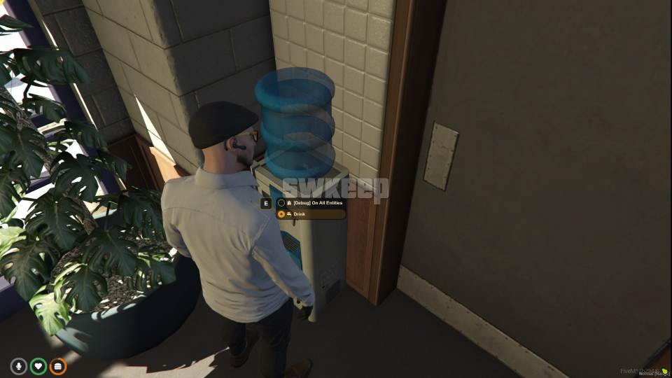

# Water Cooler Script

This is a simple FiveM script that allows players to interact with a water cooler using the interaction menu.

You can download interaction menu in here [Click Here](https://github.com/swkeep/interaction-menu)

The script is designed for use with qb-core and qb-hud, but due to its simplicity, it should be easy to adapt it for other frameworks, HUDs, and target scripts.

Features:

- Functional water cooler
- Option to kill players if they consume excessive amounts of water
- Supports `interactionMenu` / `ox_target` / `qb-target`

## Installation

Installation should not pose any significant issues. Ensure that you have my interaction menu installed and place this script after those dependencies in your `server.cfg` file:

```lua
ensure interactionRenderer
ensure interactionDUI
ensure interactionMenu

ensure qb-core
ensure qb-hud

...

ensure keep-watercooler
```
